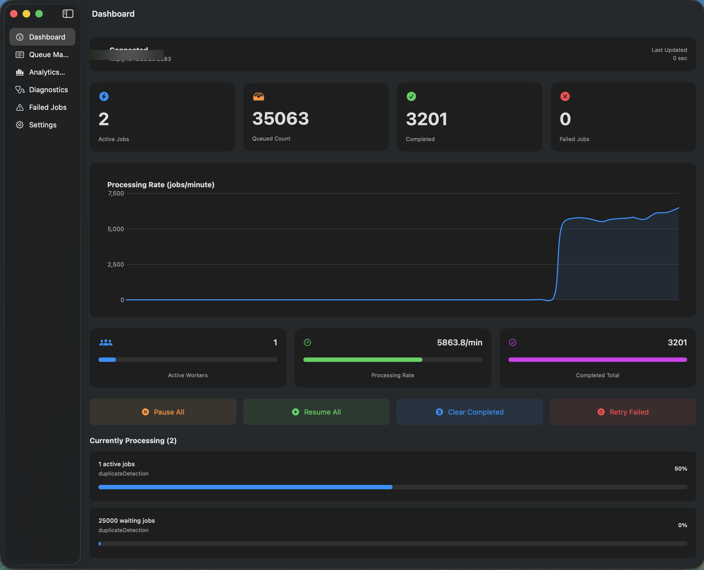
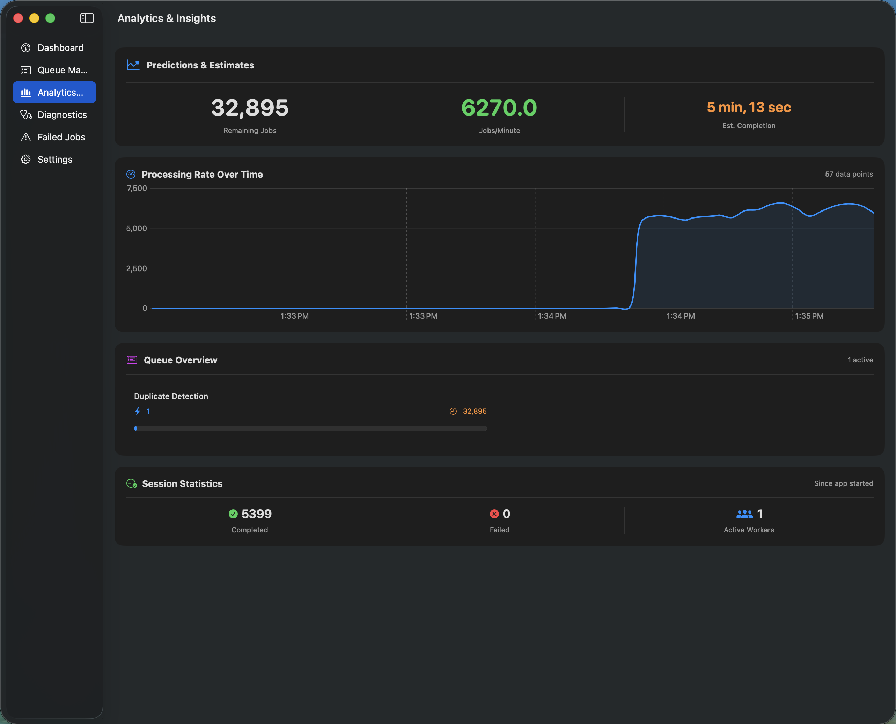
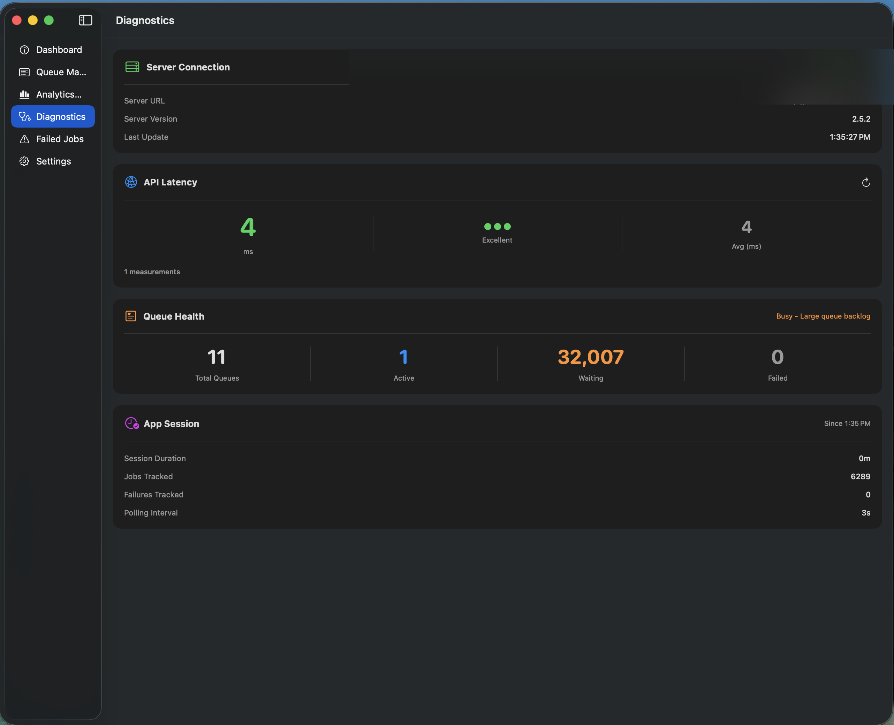
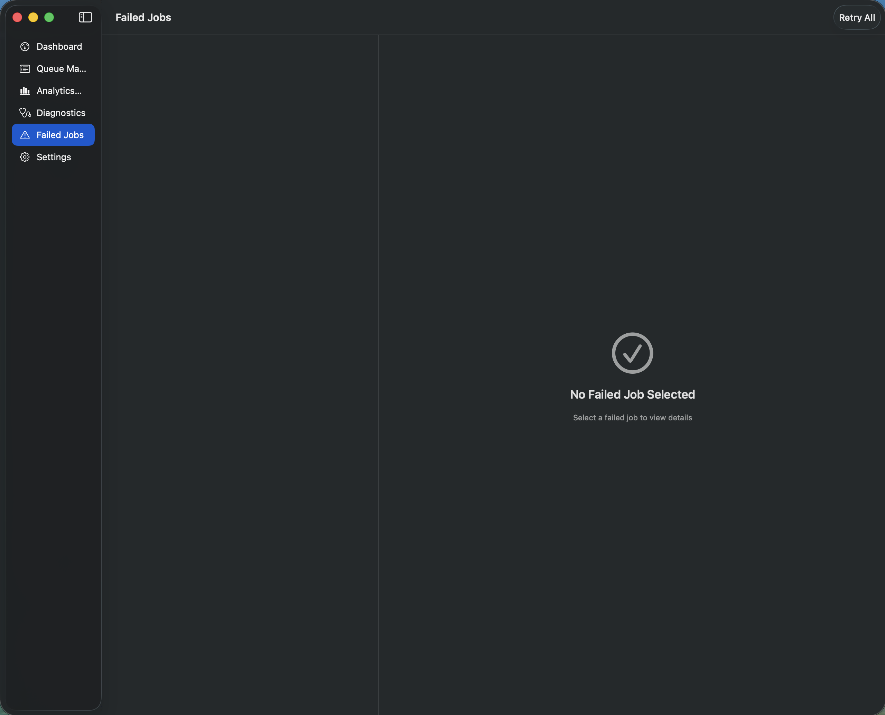
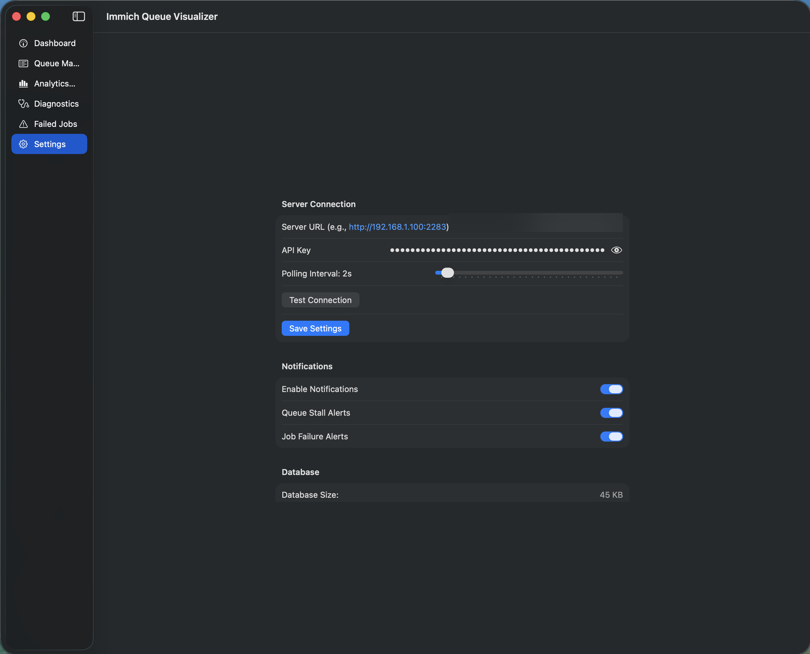

# Immich Job Queue Visualizer

**The ultimate macOS companion app for [Immich](https://immich.app) — monitor, manage, and optimize your photo server's job queues in real-time.**

[](https://github.com/bytePatrol/Immich-Job-Visualizer/releases)
[](https://swift.org)
[](LICENSE)
[](https://github.com/bytePatrol/Immich-Job-Visualizer/releases)

---

## Why Immich Job Queue Visualizer?

Running an Immich server means managing thousands of background jobs — thumbnail generation, video transcoding, face recognition, smart search indexing, and more. Without visibility into these queues, you're flying blind.

**Immich Job Queue Visualizer** gives you complete control:

- **See everything** — Real-time dashboard shows exactly what's happening across all 17 queue types
- **Act instantly** — Pause, resume, retry, or clear jobs with a single click
- **Understand trends** — Historical analytics reveal bottlenecks and performance patterns
- **Stay informed** — Menu bar integration keeps you updated without interrupting your workflow
- **Debug faster** — Full error details and stack traces for failed jobs

Built natively in Swift for macOS, it's fast, lightweight, and feels right at home on your Mac.

---

## Screenshots

### Dashboard
Real-time overview of all job queues with live statistics, processing rates, and quick action buttons.



### Queue Management
Deep dive into any queue — filter, search, and manage individual jobs with detailed progress tracking.


### Analytics & Insights
Understand your server's performance with historical trends, processing time analysis, and outlier detection.



### Diagnostics
Monitor system health including API latency, connection status, and server configuration details.



### Failed Jobs
Track and retry failed jobs with complete error information, stack traces, and asset metadata.



### Settings
Simple configuration — just enter your server URL and API key to get started.



---

## Features

### Real-Time Dashboard
- **Live Statistics** — Active jobs, queued count, completed today, and failed jobs at a glance
- **Processing Rate Graph** — Visualize jobs/minute over time with Swift Charts
- **Quick Actions** — Pause All, Resume All, Clear Completed, Retry Failed with one click
- **Auto-Refresh** — Configurable polling interval from 1-30 seconds
- **Menu Bar Mode** — Quick access without opening the full window

### Queue Management
Monitor and control all 17 Immich queue types:
- Thumbnail Generation
- Metadata Extraction
- Video Conversion
- Smart Search Indexing
- Face Detection & Recognition
- Duplicate Detection
- Sidecar Processing
- Library Management
- Storage & Migration
- Notifications
- And more...

**Powerful Controls:**
- Filter by job status (active, waiting, paused, completed, failed)
- Search across all jobs
- Batch operations on multiple jobs
- Detailed job information with progress tracking

### Analytics & Insights
- **Time Range Analysis** — View trends over 24 hours, 7 days, or 30 days
- **Performance Profiling** — Identify slow queues and file types
- **Job Timeline** — Visualize processing patterns throughout the day
- **Outlier Detection** — Spot unusually slow jobs that may indicate problems
- **Completion Estimates** — Predict when large batches will finish

### Diagnostics
- **Connection Monitoring** — API latency and server response times
- **Configuration Display** — Server URL and connection status
- **Health Indicators** — Visual status for all monitored systems
- **Real-Time Logs** — Filter and search through recent activity

### Failed Jobs Management
- **Complete Error History** — Full stack traces and error messages
- **Asset Information** — File paths, EXIF data, and metadata
- **One-Click Retry** — Requeue failed jobs individually or in bulk
- **Persistent Records** — History survives even after clearing queues

### Data Persistence
- **SQLite Storage** — Historical metrics stored locally for offline access
- **Automatic Cleanup** — Configurable data retention policies
- **Database Tools** — Vacuum and optimize your local database

---

## Installation

### Download (Recommended)

1. **Get the latest release:**
   - Download from [**Releases**](https://github.com/bytePatrol/Immich-Job-Visualizer/releases)
   - Look for `ImmichJobQueueVisualizer.dmg`

2. **Install the app:**
   - Open the DMG file
   - Drag **Immich Job Queue Visualizer** to your Applications folder

3. **First Launch — Important!**

   > **Note:** This app is code-signed but not notarized with Apple (which requires a paid developer account). macOS Gatekeeper will show a warning on first launch. This is normal for open-source Mac apps.

   **To open the app:**

   1. Try to open the app normally — macOS will block it
   2. Open **System Settings** → **Privacy & Security**
   3. Scroll down to find the security message about the blocked app
   4. Click **"Open Anyway"**
   5. Click **"Open"** in the confirmation dialog

   You only need to do this once. After that, the app opens normally.

4. **Configure:**
   - Launch the app
   - Press `Cmd+,` to open Settings
   - Enter your Immich server URL (e.g., `http://192.168.1.100:2283`)
   - Paste your API key
   - Click **Test Connection** then **Save Settings**

### Build from Source

<details>
<summary>Click to expand developer instructions</summary>

**Requirements:**
- macOS 13.0 or later
- Xcode 15+ or Swift 5.9+

**Steps:**

```bash
# Clone the repository
git clone https://github.com/bytePatrol/Immich-Job-Visualizer.git
cd Immich-Job-Visualizer

# Build the application
./Scripts/build.sh

# Create the .app bundle
./Scripts/create-app.sh

# (Optional) Create a DMG installer
./Scripts/create-dmg.sh

# Install to Applications
cp -r "Immich Job Queue Visualizer.app" /Applications/
```

</details>

### Getting Your Immich API Key

1. Open your Immich web interface
2. Click your profile icon → **Account Settings**
3. Navigate to **API Keys**
4. Click **New API Key**
5. Name it "Queue Visualizer" and click **Create**
6. Copy the key immediately (it won't be shown again)

---

## Keyboard Shortcuts

| Shortcut | Action |
|----------|--------|
| `Cmd+1` | Dashboard |
| `Cmd+2` | Queue Management |
| `Cmd+3` | Analytics & Insights |
| `Cmd+4` | Diagnostics |
| `Cmd+5` | Failed Jobs |
| `Cmd+,` | Settings |
| `Cmd+Shift+P` | Pause All Jobs |
| `Cmd+Shift+R` | Resume All Jobs |
| `Cmd+Shift+F` | Retry Failed Jobs |
| `Cmd+Shift+K` | Clear Completed Jobs |

---

## Technical Details

### System Requirements
- macOS 13.0 (Ventura) or later
- Apple Silicon or Intel Mac
- Network access to your Immich server

### Technology Stack
- **Language:** Swift 5.9
- **UI Framework:** SwiftUI
- **Charts:** Swift Charts
- **Networking:** URLSession with async/await
- **Database:** SQLite via [SQLite.swift](https://github.com/stephencelis/SQLite.swift)
- **State Management:** Combine framework

### Data Storage
- **Settings:** `~/Library/Preferences/com.immich.queuevisualizer.plist`
- **Metrics Database:** `~/Library/Application Support/ImmichJobQueueVisualizer/metrics.db`

### API Endpoints Used
- `GET /api/server/ping` — Connection test
- `GET /api/jobs` — Fetch queue information
- `PUT /api/jobs/{queueName}` — Pause/resume queues
- `POST /api/jobs/{queueName}/{command}` — Job commands

---

## Contributing

Contributions are welcome! Whether it's bug fixes, new features, or documentation improvements.

1. Fork the repository
2. Create your feature branch (`git checkout -b feature/amazing-feature`)
3. Commit your changes (`git commit -m 'Add amazing feature'`)
4. Push to the branch (`git push origin feature/amazing-feature`)
5. Open a Pull Request

---

## Roadmap

- [ ] WebSocket support for instant updates (no polling)
- [ ] iOS companion app
- [ ] Multi-server monitoring
- [ ] Prometheus metrics exporter
- [ ] Slack/Discord notifications
- [ ] Smart scheduling rules
- [ ] Worker tuning recommendations

---

## Support

- **Bug Reports:** [GitHub Issues](https://github.com/bytePatrol/Immich-Job-Visualizer/issues)
- **Feature Requests:** [GitHub Discussions](https://github.com/bytePatrol/Immich-Job-Visualizer/discussions)
- **Immich Community:** [Discord](https://discord.gg/immich) / [Reddit](https://reddit.com/r/immich)

---

## License

This project is licensed under the MIT License — see the [LICENSE](LICENSE) file for details.

---

## Acknowledgments

- [Immich](https://immich.app) — The amazing self-hosted photo solution this app was built for
- [SQLite.swift](https://github.com/stephencelis/SQLite.swift) — Elegant SQLite wrapper for Swift
- [SF Symbols](https://developer.apple.com/sf-symbols/) — Beautiful icons from Apple

---

## Disclaimer

This is an independent, community-built project. It is not officially affiliated with or endorsed by the Immich project.

---

<p align="center">
  <strong>Built with care for the Immich community</strong>
  <br>
  <sub>If you find this useful, consider giving it a star!</sub>
</p>
