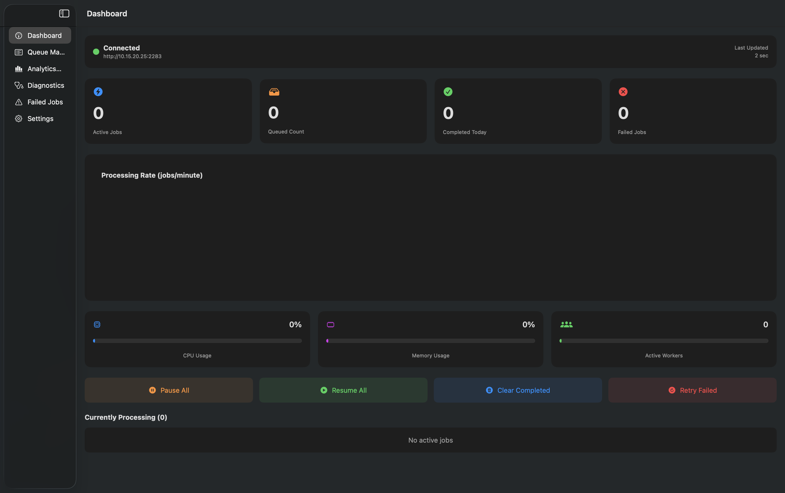
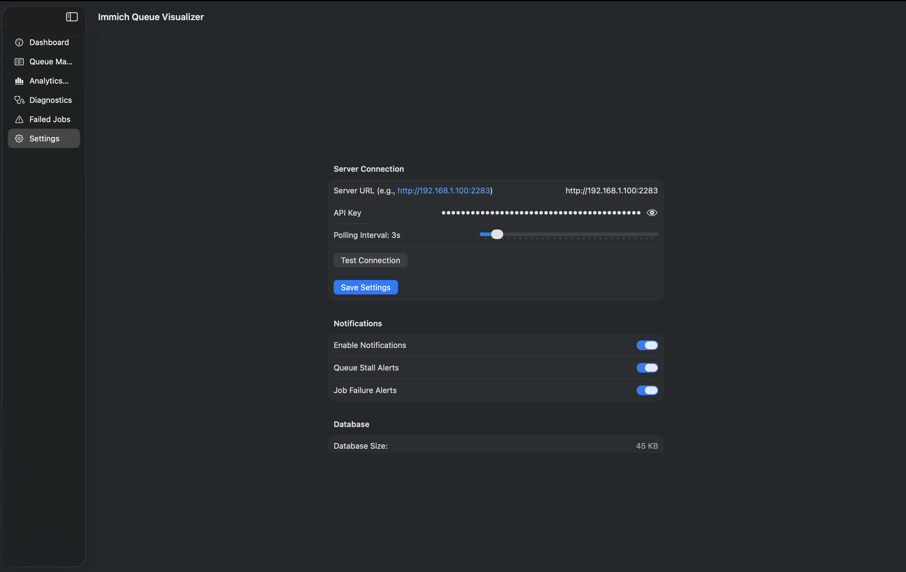
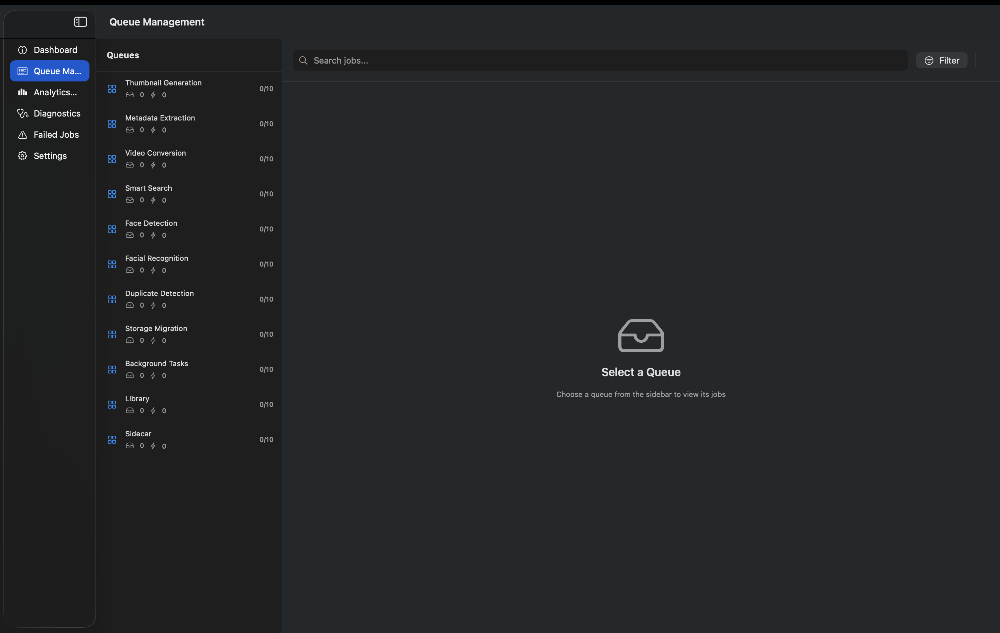

# Immich Job Queue Visualizer

A comprehensive, native macOS application for monitoring and managing [Immich](https://immich.app) photo server job queues in real-time.


## ✨ Features

### 📊 Real-Time Dashboard
- Live job statistics with auto-refresh (configurable 1-30 second intervals)
- Processing rate graphs showing jobs/minute over time
- System resource monitoring (CPU, memory, active workers)
- Quick action buttons for common operations (pause/resume/retry)
- Menu bar integration for quick access

### 🔧 Queue Management
- Monitor all 17 Immich queue types:
  - Thumbnail Generation
  - Metadata Extraction
  - Video Conversion
  - Smart Search
  - Face Detection & Recognition
  - Duplicate Detection
  - And more...
- Advanced filtering and search capabilities
- Batch operations (pause, resume, cancel, retry)
- Detailed job information with progress tracking

### 📈 Analytics & Insights
- Historical trend analysis (24 hours, 7 days, 30 days)
- Performance profiling by queue and file type
- Job timeline visualization
- Resource correlation graphs (CPU/Memory vs completion rate)
- Outlier detection for slow-running jobs
- Predictive completion time estimates

### 🔍 Diagnostics
- PostgreSQL connection pool monitoring
- Network latency tracking
- Storage I/O statistics
- Memory leak detection
- Real-time log viewer with filtering
- System health indicators

### ❌ Failed Jobs Management
- Complete error history with stack traces
- Asset metadata and EXIF data viewing
- Individual and batch retry capabilities
- Persistent forensic records (survives queue clearing)
- Export failed job reports

### 💾 Data Persistence
- SQLite-backed historical metrics storage
- Automatic data retention management
- Performance optimization tools
- Database vacuum and maintenance

## 🚀 Installation

### For End Users (Recommended)

1. **Download the latest release:**
   - Go to [Releases](https://github.com/bytePatrol/Immich-Job-Visualizer/releases)
   - Download `ImmichJobQueueVisualizer-v1.0.0-macOS.zip`

2. **Install:**
   - Double-click the zip to extract
   - Drag `ImmichJobQueueVisualizer.app` to your Applications folder
   - Right-click the app and select "Open" (first time only due to macOS security)

3. **Configure:**
   - Press `Cmd+,` to open Settings
   - Enter your Immich server URL and API key
   - Click "Test Connection" and "Save Settings"

### For Developers (Build from Source)

<details>
<summary>Click to expand build instructions</summary>

1. **Clone the repository:**
```bash
   git clone https://github.com/bytePatrol/Immich-Job-Visualizer.git
   cd Immich-Job-Visualizer
```

2. **Build the application:**
```bash
   chmod +x build.sh
   ./build.sh
```

3. **Create the .app bundle:**
```bash
   chmod +x create-app.sh
   ./create-app.sh
```

4. **Install:**
```bash
   cp -r ImmichJobQueueVisualizer.app /Applications/
```

</details>

### Getting Your Immich API Key

1. Open your Immich web interface
2. Navigate to **Account Settings** > **API Keys**
3. Click **"New API Key"**
4. Give it a name (e.g., "Queue Visualizer")
5. Copy the generated key and paste into the app settings

## 🎯 Usage

### Keyboard Shortcuts
- `Cmd+1` - Dashboard
- `Cmd+2` - Queue Management
- `Cmd+3` - Analytics & Insights
- `Cmd+4` - Diagnostics
- `Cmd+5` - Failed Jobs
- `Cmd+,` - Settings
- `Cmd+Shift+P` - Pause All Jobs
- `Cmd+Shift+R` - Resume All Jobs
- `Cmd+Shift+F` - Retry Failed Jobs
- `Cmd+Shift+K` - Clear Completed Jobs

### Configuration

The app stores its configuration in:
- **Settings**: `~/Library/Preferences/com.immich.queuevisualizer.plist`
- **Database**: `~/Library/Application Support/ImmichJobQueueVisualizer/metrics.db`

Default polling interval is 3 seconds, adjustable from 1-30 seconds.

## 🏗️ Architecture

### Technology Stack
- **UI Framework**: SwiftUI (declarative, reactive)
- **Charts**: Swift Charts framework
- **Networking**: URLSession with async/await
- **Database**: SQLite with SQLite.swift
- **State Management**: Combine framework
- **Data Persistence**: UserDefaults + SQLite

### Project Structure
```
ImmichJobQueueVisualizer/
├── ImmichJobQueueVisualizerApp.swift   # App entry point
├── Models.swift                         # Data models
├── ImmichService.swift                  # API client
├── DatabaseManager.swift                # SQLite layer
├── DashboardView.swift                  # Main dashboard
├── QueueManagementView.swift           # Queue management
├── AnalyticsView.swift                  # Analytics views
├── AdditionalViews.swift                # Supporting views
└── ContentView.swift                    # Navigation
```

### API Integration

Connects to Immich API endpoints:
- `GET /api/server/ping` - Connection test
- `GET /api/jobs` - Fetch all queue information
- `POST /api/jobs/{queueName}/pause` - Pause queue
- `POST /api/jobs/{queueName}/resume` - Resume queue
- And more...

## 📸 Screenshots

### Main Dashboard


### Settings


### Queue Manager


## 🤝 Contributing

Contributions are welcome! Please feel free to submit a Pull Request. For major changes, please open an issue first to discuss what you would like to change.

### Development Setup

1. Fork the repository
2. Create your feature branch (`git checkout -b feature/AmazingFeature`)
3. Commit your changes (`git commit -m 'Add some AmazingFeature'`)
4. Push to the branch (`git push origin feature/AmazingFeature`)
5. Open a Pull Request

## 🐛 Known Issues

- Immich API structure may vary between versions - tested with current Immich releases
- First-time launch requires right-click → Open due to unsigned app bundle
- Some advanced features (WebSocket, Prometheus export) are designed but not yet implemented

## 🗺️ Roadmap

- [ ] WebSocket support for true real-time updates
- [ ] iOS companion app
- [ ] Multi-server monitoring
- [ ] Prometheus metrics exporter
- [ ] Worker tuning wizard
- [ ] Smart scheduling rules
- [ ] Slack/Discord webhook integration

## 📝 License

This project is licensed under the MIT License - see the [LICENSE](LICENSE) file for details.

## 🙏 Acknowledgments

- Built with [SQLite.swift](https://github.com/stephencelis/SQLite.swift)
- Icons from SF Symbols
- Inspired by the amazing [Immich](https://immich.app) project

## 💬 Support

- **Issues**: [GitHub Issues](https://github.com/bytePatrol/Immich-Job-Visualizer/issues)
- **Discussions**: [GitHub Discussions](https://github.com/bytePatrol/Immich-Job-Visualizer/discussions)

## ⚠️ Disclaimer

This is an independent project and is not officially affiliated with or endorsed by the Immich project.

---

**Built with ❤️ for the Immich community**
